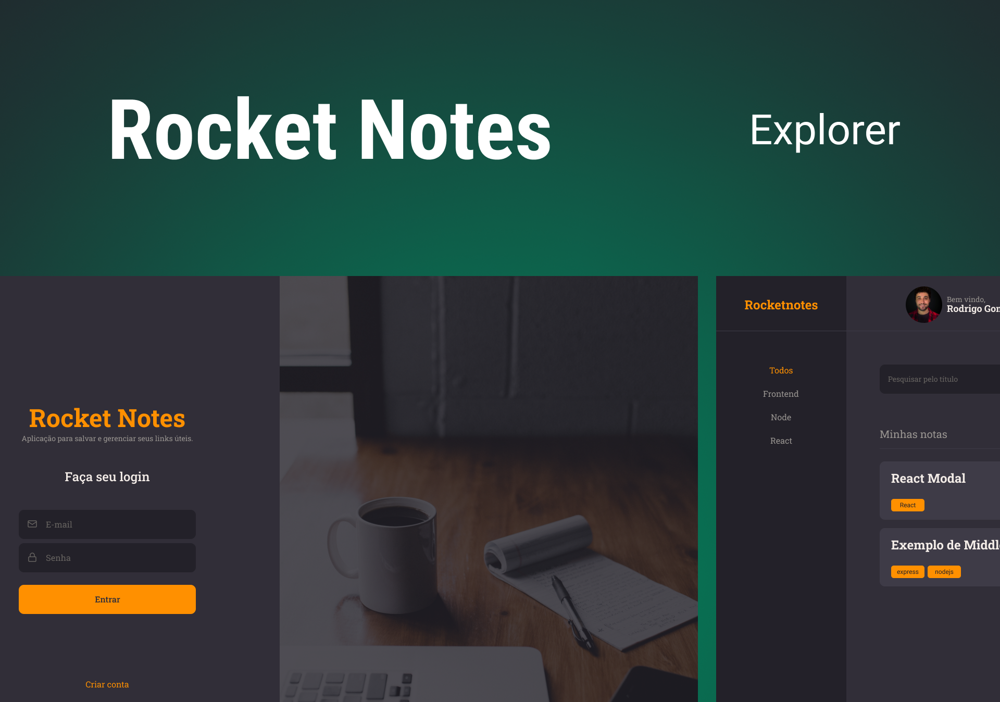

<h1 align="center"> RocketNotes </h1>

Aplicação para salvar e gerenciar seus links úteis.

  <a href="#-tecnologias">Tecnologias</a>&nbsp;&nbsp;&nbsp;|&nbsp;&nbsp;&nbsp;
  <a href="#-projeto">Projeto</a>&nbsp;&nbsp;&nbsp;|&nbsp;&nbsp;&nbsp;

  

 

  

## 🚀 Tecnologias

Esse projeto foi desenvolvido com as seguintes tecnologias:

- ReactJS
- NodeJS(Express)
- SQLite
- Knex

## 💻 Projeto

O RocketNotes é uma aplicação para salvar e gerenciar seus links úteis.
##
